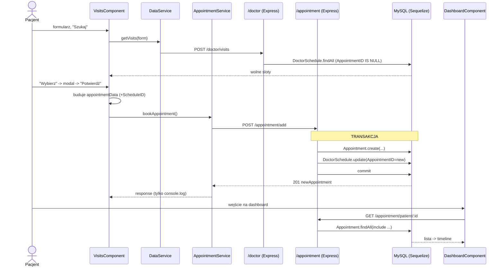

# Research: przepływ umawiania wizyty (appointment booking)

**Cel (z mapy):** wybrany ze `Stref ryzyka` / `Pierwszy dzień` przepływ rdzeniowy produktu.
Wejście: `context/map/repo-map.md`. Entry pointy: `visits.component.ts`, `appointment.service.ts`,
`backend/src/routes/appointmentRoutes.js`. Metoda: `/10x-research` z trzema sub-agentami
(trace e2e / luki w testach / blast radius). **Eksploracja, nie refaktor.**

> **Rygor dowodowy:** [E] = evidence (potwierdzone w kodzie, `plik:linia`), [I] = inference
> (wniosek z wzorca), [U] = unknown (nie ustalono). Twierdzenia **strukturalne** (liczby,
> „tylko tu", „zawsze przez X") oznaczone 🔬 — do weryfikacji ast-grep w kroku 2.2.

---

## ② Feature overview

Umawianie wizyty to **przepływ dwufazowy**, rozłożony na DWA backendowe zasoby (`/doctor` i
`/appointment`) — to nie jest pojedynczy „book" endpoint.

**Faza A — wyszukanie wolnego terminu** (zasób `/doctor`):
1. [E] Formularz w `visits.component.html:5-65` (specjalizacja, miasto, data, typ); `searchForm` w `visits.component.ts:49-54`.
2. [E] „Szukaj" → `searchVisits()` (`visits.component.ts:94-98`) → `DataService.getVisits()` → `POST /doctor/visits` (`data.service.ts:30-32`).
3. [E] `doctorController.getVisits` (`doctorController.js:47-55`) → `doctorService.getVisits` (`doctorService.js:85-132`): `DoctorSchedule.findAll` z `AvailableDate >= date` **i `AppointmentID IS NULL`** (tylko wolne sloty), join Doctor/Profile.

**Faza B — właściwe umówienie** (zasób `/appointment`):
4. [E] „Wybierz" → `bookVisit(visit)` (`visits.component.ts:100`): dane usera z **localStorage** (`user.service.ts:17-28`), modal potwierdzenia `ConfirmModalComponent`.
5. [E] Po `'confirmed'` budowany `appointmentData` (`visits.component.ts:106-117`): `PatientID`, `DoctorID`, `AppointmentDate = AvailableDate + ' ' + TimeSlotFrom`, `Status:'zaplanowana'`, `Diagnosis/Treatment/SurveyID = null`, **`ScheduleID`**.
6. [E] `appointmentService.bookAppointment()` → `POST /appointment/add` (`appointment.service.ts:13-15`; mount `app.js:57`).
7. [E] `appointmentController.createAppointment` (`appointmentController.js:3-13`) → `appointmentService.createAppointment` (`appointmentService.js:9-32`) w **transakcji Sequelize**:
   - `Appointment.create(appointmentData, {transaction})` (`:12-14`)
   - `DoctorSchedule.update({AppointmentID: new}, {where:{ScheduleID}, transaction})` (`:16-24`) — oznaczenie slotu zajętym
   - `commit()` (`:26`); błąd → `rollback()` + `throw` (`:29-30`) → kontroler `500` z `error.message`.
8. [E] Zapis do MySQL przez Sequelize, baza `portal_pacjenta` (`db.js:3-6`).
9. [E] **Sukces = tylko `console.log`** (`visits.component.ts:121`) — brak feedbacku UI, odświeżenia, komunikatu.

**Faza C — odczyt** (dashboard):
10. [E] `dashboard.component.ts:84` → `getPatientAppointments(id)` → `GET /appointment/patient/:patientId` → `Appointment.findAll` (include Doctor/Profile, DoctorSchedule, Prescription; sort `AppointmentDate ASC`) (`appointmentService.js:34-66`). Klasyfikacja przyszłe/historyczne (`dashboard.component.ts:118-129`).

**Kształt zapisu:** [E] czysty Sequelize ORM (brak surowego SQL na tej ścieżce); jedyny side-effect
to oznaczenie slotu `DoctorSchedule.AppointmentID`. Tabela `appointments` (`AppointmentID` PK auto,
`timestamps:false`; `appointmentModel.js:4-45`).

**Ankieta przedwizytowa (survey) NIE jest częścią umawiania** [E]: `SurveyID` zawsze `null` przy
booku (`visits.component.ts:115`); survey to osobny przepływ z dashboardu (`POST /survey/add`),
zapisywany do **MongoDB** (`mongoose.connect` `app.js:19-30`; eksport `Portal-pacjenta.preappointmentsurveys.json`),
wiązany z wizytą przez `AppointmentID`, nie przez `appointments.SurveyID`. [U] Nic nie aktualizuje
`appointments.SurveyID` po zapisie ankiety — pole zostaje `null`.

---

## ③ Technical debt

Mapa krzyczała „czuły rejon" — research zamienia to w **konkretne rodzaje kruchości**. Uporządkowane wg ryzyka:

### 🔴 1. Szew kontraktu FE↔BE bez żadnej bariery (najgroźniejszy, „cichy" dług)
- [E] FE typuje payload jako **`any`**: `bookAppointment(appointmentData: any): Observable<any>` (`appointment.service.ts:13`). URL **zahardkodowany** `http://localhost:3000/appointment`.
- [E] Backend: `req.body` → `Appointment.create(appointmentData)` **bez walidacji** (brak express-validator/DTO na tej ścieżce) (`appointmentController.js:5-8`, `appointmentService.js:12`). 🔬 „brak walidatora na ścieżce appointment"
- [E] **Rozjazd `ScheduleID`:** FE wysyła `ScheduleID`, którego **nie ma w `appointmentModel`** — jest konsumowany tylko do `DoctorSchedule.update` (`appointmentService.js:16-24`). FE musi znać wewnętrzny szczegół schematu lekarza. 🔬 „`ScheduleID` nieobecny w appointmentModel"
- **Connascence znaczenia na dużym dystansie, bez bariery narzędziowej** [I]: zmiana nazwy/typu/formatu dowolnego pola (np. `AppointmentDate` sklejany stringowo, `visits.component.ts:111`) wymaga ręcznej, skoordynowanej edycji w ≥3 miejscach w 2 połówkach repo; ani TS (`any`), ani runtime BE tego nie złapie. To dokładnie ten typ długu, który mapa (granica FE↔BE = `unknown` dla grafu) mogła tylko zasygnalizować.

### 🔴 2. Brak autoryzacji na endpointach appointment → **systemowy** (doprecyzowane 2.2)
- [E] `appointmentRoutes.js:5,8` — **żadnego middleware auth** (ast-grep: 2 trasy, każda z jednym handlerem; grep: zero słów auth).
- [E ✅2.2] **Doprecyzowanie:** brak ochrony NIE jest specyficzny dla appointment — `passport.authenticate` **nie jest użyty jako guard w ŻADNYM route** (`backend/src/routes/`). `passport` jest tylko zainicjowany globalnie (`app.js:41-42`) i skonfigurowany (`passportConfig.js:5`), ale faktycznie **nie egzekwuje niczego**. To dług całego backendu, nie tylko tej ścieżki.
- [E] `PatientID` pochodzi z **localStorage klienta**, niezweryfikowany serwerowo; brak HTTP interceptora dołączającego token (`app.config.ts:28` tylko `provideHttpClient()`). [I] Każdy może utworzyć/odczytać wizyty dla dowolnego `PatientID` (IDOR).

### 🟠 3. Brak ochrony przed double-booking
- [I] Filtr „wolny slot" (`AppointmentID IS NULL`) jest TYLKO w wyszukiwaniu (`doctorService.js:91-94`). `createAppointment` **nie sprawdza** zajętości slotu przed zapisem — `DoctorSchedule.update` nadpisuje `AppointmentID` bezwarunkowo (`appointmentService.js:16-24`). Brak unikalnego ograniczenia → możliwy silent overwrite / race przy równoległych zgłoszeniach. 🔬 „brak warunku zajętości w createAppointment"

### 🟠 4. Zero realnego pokrycia testami (0/12 metod ścieżki)
- [E] **Backend: brak runnera testów w ogóle** — `backend/package.json:8` to placeholder `echo "Error: no test specified" && exit 1`; brak jest/mocha/supertest.
- [E] **Frontend: 4 pliki `*.spec.ts` na ścieżce to wyłącznie scaffolding** (`expect(...).toBeTruthy()`): `appointment.service.spec.ts:13`, `visits.component.spec.ts:20`, `dashboard.component.spec.ts:20`, `visit-survey-details.component.spec.ts:20`. `appointment.service.spec.ts:8-9` ma pusty `TestBed` bez `HttpClientTestingModule`. 🔬 „4 spec-i, 0 asercji biznesowych"
- **Efektywne pokrycie ścieżki = 0%** [E] przy istnieniu plików spec → *false sense of coverage*. Nietestowane gałęzie krytyczne: rollback transakcji, ścieżka 500, double-booking, walidacja wejścia, FE error-callback, gałąź `'confirmed'` vs dismiss.

### 🟡 5. Brak feedbacku UX po sukcesie
- [E] Po `201` tylko `console.log` (`visits.component.ts:121`); błąd tylko `console.error` (`:123-125`). Wizyta widoczna dopiero po ręcznym przejściu na dashboard. Pogarsza też testowalność (brak obserwowalnego efektu).

### 🟡 6. Sprzężenie appointment ↔ doctorModel (dwukierunkowe asocjacje)
- [E graf+git, ✅2.2] `appointmentService` importuje **4 klasy** z `doctorModel.js` (DoctorSchedule, Profile, Doctor, Prescription); `doctorModel.js` importuje `appointmentModel.js` — **dwukierunkowe/cykliczne asocjacje Sequelize**, współzmiana 4/5 commitów. Ruszenie schematu wizyty łamie zapytania `include`/`DoctorSchedule.update`.
- [E ✅2.2] **Doprecyzowanie:** to **4 osobne instrukcje `require("../models/doctorModel")`** (`appointmentService.js:2-5`), nie jeden destrukturyzowany import — dodatkowy zapach (4× ładowanie tego samego modułu).

### ⚪ Drobne zapachy
- [E] `appointmentService.js:70-71` — `getPatientAppointments` w `module.exports` **dwukrotnie** (martwy duplikat). 🔬
- [E] `db.js:3-6` — zahardkodowane creds (`root`, puste hasło), ignoruje `process.env` poza `DB_HOST`.

### Dług PRAWDZIWY vs TANI (rozdzielenie)
- **Tani / mechaniczny (ignorować przy ocenie kosztu):** współzmiany z bulk-commitów `e8159b1 "folder names change"` (68 plików, rename `shared/core`→`components/services`) i `final changes magisterka` (21 plików) sztucznie zawyżają co-change całego FE — **nie** sprzężenie logiczne. `config/db.js` ↔ docker-compose to zmiany infra, nie kontraktu wizyty.
- **Prawdziwy (ukryty kontrakt bez bariery):** szew FE↔BE (#1), cykl appointment↔doctorModel (#6).

---

## Para vs hub (blast radius)
- **Ciasne pary 1:1:** `appointmentRoutes ↔ appointmentController ↔ appointmentService`; `appointment.service.ts (FE) ↔ endpointy /appointment (BE)` — para tylko przez git, **brak krawędzi importu** przez granicę HTTP.
- **Huby (szeroki promień):** `appointmentService.js` (centrum BE: appointmentModel + doctorModel×4 + db.js + szew FE); `doctorModel.js` (współdzielony appointment/doctor/survey-doctor); `dashboard.component.ts` (17 commitów, konsument appointment+data+user+survey).
- **Peryferia:** `visit-survey-details.component.ts` — 1 importer (`doctor-dashboard`), bez związku z bookiem pacjenta.

## Code References (kluczowe)
- `frontend/src/app/components/visits/visits.component.ts:100-126` — `bookVisit`, budowa payloadu, brak feedbacku
- `frontend/src/app/services/appointment.service.ts:13-19` — `bookAppointment`/`getPatientAppointments`, typ `any`, URL hardcoded
- `backend/src/controllers/appointmentController.js:3-13` — `createAppointment`, brak walidacji, 500 z `error.message`
- `backend/src/services/appointmentService.js:9-32` — transakcja create+update; `:70-71` podwójny eksport
- `backend/src/models/appointmentModel.js:4-45` — schemat, tylko `allowNull`
- `backend/src/routes/appointmentRoutes.js:5,8` — brak auth middleware
- `backend/src/services/doctorService.js:85-132` — wyszukiwanie wolnych slotów
- `backend/src/config/db.js:3-6` — Sequelize, hardcoded creds

## Architecture Insights
- Backend trzyma poprawną warstwowość (routes→controller→service→model), ale **logika domenowa wizyty
  rozlana** między walidację UI, sklejanie payloadu w komponencie i transakcję w serwisie — brak
  jednego miejsca egzekwowania reguł wizyty (kandydat na agregat w Fazie 4 DDD).
- Granica FE↔BE jest „papierowa": `any` + brak DTO/walidatora to główne źródło ryzyka regresji.

## Historical Context
- Spójne z `context/map/repo-map.md` i `artifact-2-structure.md`: backend zamrożony od 09.2024,
  projekt magisterski, bus factor 1. Cienkie pokrycie testów potwierdza założenie `kroki.md` „brak warstwy testów".

## Open Questions (unknown)
- [U] Czy `appointments.SurveyID` jest gdziekolwiek aktualizowane po zapisie ankiety? (nie znaleziono)
- [U] Czy `ng test` faktycznie przechodzi (nie uruchamiano runnera — ocena z treści plików).
- [U] Czy istnieje serwerowa deduplikacja slotów na poziomie bazy (unique index) — nie znaleziono w modelu; potwierdzić na schemacie DB.

## Weryfikacja twierdzeń strukturalnych (ast-grep + grep) — krok 2.2

Każde twierdzenie „zero/tylko/dokładnie" potwierdzone dwoma narzędziami (reguła m4l3: zero z ast-grep
podejrzane, dopóki grep nie potwierdzi). Werdykty: ✅ potwierdzone · 🔁 doprecyzowane · ❌ obalone.

| # | Twierdzenie | Werdykt | Dowód (plik:linia) |
|---|---|---|---|
| 1 | `appointmentRoutes` — zero middleware auth | 🔁 **doprecyzowane** | ast-grep: 2 trasy z 1 handlerem (`appointmentRoutes.js:5,8`); grep auth = 0. **Szerzej:** `passport.authenticate` nieużyty w ŻADNYM route — brak auth jest **systemowy**, nie tylko tu. passport tylko `initialize/session` (`app.js:41-42`). |
| 2 | Brak walidacji wejścia na ścieżce appointment | ✅ **potwierdzone** | grep+ast-grep: zero `validationResult/body()/check/joi/zod/if(!req.body)` w controller+service+routes; `express-validator` **nieobecny w całym backendzie**. |
| 3 | `ScheduleID` nieobecny w `appointmentModel`, obecny w FE+service | ✅ **potwierdzone** | model: 0 trafień; `visits.component.ts:116`, `appointmentService.js:20`. Rozjazd kontraktu potwierdzony. |
| 4 | `getPatientAppointments` eksportowany 2× | ✅ **potwierdzone** | `appointmentService.js:70` i `:71` — dwa wpisy w `module.exports`. |
| 5 | 4 klasy importowane z `doctorModel` | 🔁 **doprecyzowane** | `appointmentService.js:2-5` — 4 klasy (DoctorSchedule, Profile, Doctor, Prescription), ale jako **4 osobne `require`** tego samego modułu (zapach). |
| 6 | Spec-i = tylko `toBeTruthy`, bez mocków HTTP (4 pliki) | ✅ **potwierdzone** | każdy z 4 spec-ów: 1× `it`, 1× `expect`, 1× `toBeTruthy`; ast-grep: brak innych asercji; grep: 0 `HttpTestingController`. |
| 7 | `createAppointment` — brak sprawdzenia zajętości slotu | ✅ **potwierdzone** | `appointmentService.js:9-32`: jedyny `where` (`:19`) to cel `DoctorSchedule.update` (ScheduleID), nie odczyt zajętości; brak `findOne/findByPk` przed `create`. |

**Wniosek z weryfikacji:** żadne twierdzenie nie zostało obalone. Dwa doprecyzowano — i oba
doprecyzowania **wzmacniają** obraz długu: brak auth jest systemowy (#1), a sprzężenie z doctorModel
ma dodatkowy zapach 4× `require` (#5). Liczby i „zera" w sekcji ③ są teraz oparte na narzędziu, nie na lekturze.
