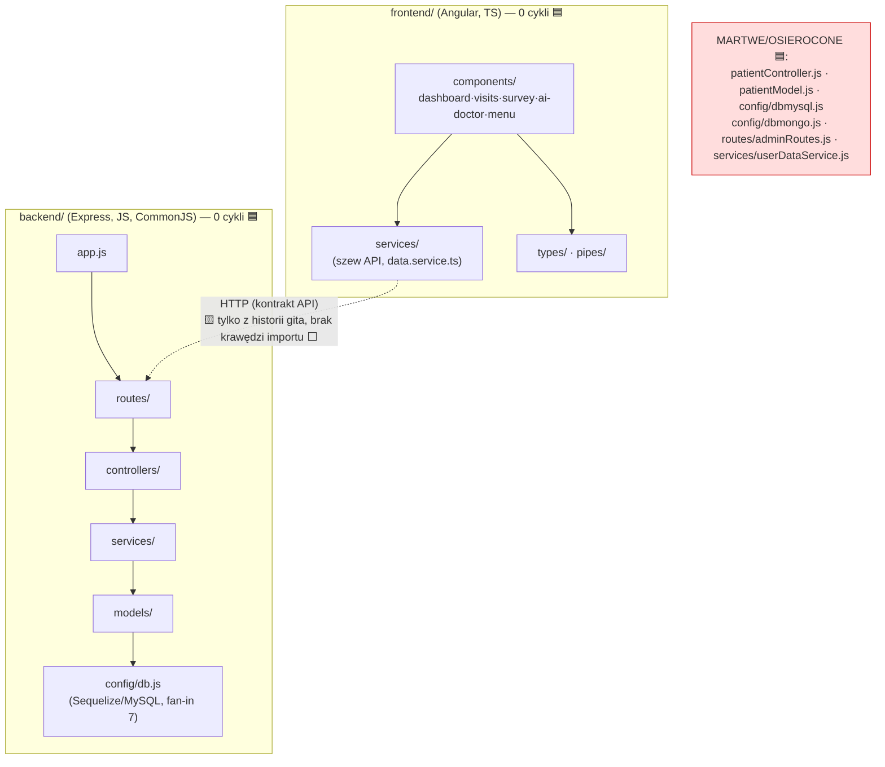

# Repo-map — portal-pacjenta (onboarding)

> Dokument wejściowy dla osoby (lub agenta) zaczynającej pracę z tym repo. Synteza trzech
> artefaktów mapy. **Eksploracja, nie implementacja.** Źródło każdego sprzężenia oznaczone:
> 🟦 graf importów · 🟨 historia gita · ⬜ `unknown` (poza zasięgiem narzędzia).

## 1. TL;DR

**portal-pacjenta** to portal pacjenta: **frontend Angular** (`frontend/`) + **backend
Node/Express** (`backend/`), powstały jako **projekt pracy magisterskiej** (commity „final changes
magisterka", 2024-09). Funkcjonalnie **zamrożony od końca 2024** — ostatni rok to wyłącznie
maintenance (upgrade Angulara 17→19, scaffolding 10xDevs), zero nowych funkcji. Praca skupiała się
na **komponentach frontu** (dashboard, visits, survey, ai-doctor, menu) i warstwie **`services`**
(szew API), a backend ma poprawną, spokojną warstwowość Express. **Struktura jest zaskakująco
czysta — zero cykli zależności po obu stronach.** Ból nie leży w architekturze, lecz w **martwym i
zduplikowanym kodzie**: niedokończona migracja bazy (surowy mysql2 → Sequelize) zostawiła
zduplikowane pliki `patient*`/`patient*2` i **trzy technologie DB, z czego dwie martwe**. Repo jest
**solo-deweloperskie (bus factor 1)** — cała wiedza u jednej osoby.

## 2. Teren — odpowiedzialność vs peryferia

- **Moduły głębokie / wysoka odpowiedzialność:**
  - `frontend/src/app/services` — 🟨 najgorętszy obszar (48 zmian) + 🟦 fundament konsumowany przez komponenty; tu żyje kontrakt z API (`data.service.ts` = „wspólny mianownik", 🟨 współzmienny z 20 obszarami).
  - `frontend/.../components/dashboard` — 🟨 najwyższy churn komponentu (20 zmian); 🟦 osadza `survey`.
  - `backend/src/config/db.js` — 🟦 fundament backendu (fan-in 7, singleton Sequelize).
  - `app.routes.ts` (🟨 28 obszarów) i `backend/src/app.js` (🟨 23) — huby okablowania.
- **Peryferia / płytkie:** `types/` (1 plik `surveyTypes.ts`), `pipes/`, `confirm-modal`.
- **Aktywność w czasie (🟨):** szczyt 2024 Q2 (22 commity) → domknięcie pod magisterkę (wrzesień
  2024) → backend zamrożony; front dotykany do 04.2025, ale **tylko maintenance**.

> **Struktura katalogów ≠ aktywność (🟨):** dwa renamey zacierają obraz w surowej historii —
> `app/shared/ → app/components/` i `app/core/ → app/services/` (2024-10-04, „folder names change").
> Stare ścieżki w historii **już nie istnieją**; wszystkie rankingi w artefaktach są znormalizowane
> do ścieżek obecnych. Skutek uboczny: `services/` wygląda na „mało zmieniany" po nazwie, choć jako
> `core/` był jednym z najgorętszych.

## 3. Realne powiązania — co naprawdę zmienia się razem

| Sprzężenie | Źródło | Natura |
|---|---|---|
| BE: `routes ↔ controllers ↔ models` | 🟦 graf + 🟨 współzmiany | **kierunkowe, nie cykliczne**; nowy endpoint dotyka całej trójki |
| BE: `controllers → services → models → config/db.js` | 🟦 graf | poprawna warstwowość; `db.js` to liść-fundament |
| FE: `components → services` | 🟦 graf | standardowy Angular; `dashboard` ciągnie `data/appointment/user.service` |
| FE: `dashboard ↔ survey` | 🟦 graf (`import`) + 🟨 współzmiana (8) | dashboard **osadza** survey |
| **FE ↔ BE (kontrakt API)** | 🟨 **tylko historia gita** (`services` współzmienny z BE) · ⬜ **brak krawędzi importu** | dwa osobne codebase'y; graf nie przekracza granicy HTTP — to `unknown` dla narzędzia, **nie** „brak powiązania" |
| `passportConfig → userModel` | 🟦 graf | przeciek warstwy (config sięga w górę do modelu) |

> **Sprzężenie „tanie" (🟨, regeneracja/tooling, nie ręczna edycja):** zryw 2025 Q2 (Angular CLI/
> Material 17→18→19, prettier/eslint) dotknął wielu plików **automatycznie** — to coupling przez
> upgrade narzędzi, nie przez logikę. Waży inaczej (taniej) niż ręczna zmiana funkcji.

## 4. Strefy ryzyka

| Strefa | Dlaczego ryzykowna |
|---|---|
| **Duplikacja `patient*` + migracja DB** | żywa ścieżka (Sequelize) i martwa (mysql2) współistnieją — łatwo zmienić zły plik |
| **3 technologie DB w `config/`** | `db.js` żyje, `dbmysql.js` quasi-martwy, `dbmongo.js` martwy — mylące, sugeruje wybór, którego nie ma |
| **Osierocone moduły** | `patientController.js`, `adminRoutes.js`, `dbmongo.js`, `userDataService.js` — kod-zombie (🟦, do potwierdzenia grepem) |
| **`config/db.js` jako globalny singleton** | fan-in 7, efekt uboczny przy imporcie → testy jednostkowe backendu trudne, ryzyko przy zmianie połączenia |
| **`passportConfig → userModel`** | auth (Generic) wpleciony w warstwę danych → trudniej wydzielić/wymienić |
| **Brak testów + bus factor 1** | jedyna walidacja zmian to autor; brak siatki bezpieczeństwa |

## 5. Kogo zapytać

**To repo jest solo-deweloperskie — bus factor = 1.** Dla **każdej** strefy jedyny kandydat to
**Kacper Kubit** (autor 57/58 commitów + alias GitHub `kacperk72`; zero commitów AI/botów).
Mapa kontrybutorów **nie różnicuje obszarów**. Dwa zastrzeżenia:
- **Wiedza o backendzie jest „stara"** (ostatnie realne zmiany 09.2024, ~21 mies. temu) — szczegóły
  decyzji (np. po co `dbmongo.js`) mogły zatrzeć się nawet u autora.
- Stąd: **weryfikuj narzędziem (ast-grep/grep), nie pamięcią.** Artefakty `context/` są jedyną
  trwałą pamięcią projektu.

## 6. Pierwszy dzień — co przeczytać (w tej kolejności)

1. `backend/src/app.js` — montaż tras i middleware; co jest podłączone, a co nie (uwaga: `adminRoutes` **nie** jest).
2. `backend/src/config/db.js` — fundament danych (Sequelize/MySQL); zrozumiesz to, rozumiesz backend.
3. `frontend/src/app/app.routes.ts` — mapa ekranów frontu (28 obszarów); szybki przegląd całości UI.
4. `frontend/src/app/services/data.service.ts` — szew API, „wspólny mianownik" FE↔BE.
5. `backend/src/routes/patientRoutes.js` → `controllers/patientController2.js` → `models/patientModel2.js` — **żywa** ścieżka pacjenta (zobacz, że używa `*2`, nie wersji bez „2").
6. `frontend/src/app/components/dashboard/dashboard.component.ts` — najgorętszy komponent; osadza `survey`.
7. `frontend/src/app/components/visits/visits.component.ts` **lub** `survey/survey.component.ts` — rdzeniowy przepływ, kandydat na research Fazy 2.
8. *(kontrast)* `backend/src/controllers/patientController.js` + `config/dbmongo.js` — zobacz **martwy** kod, żeby go nie pomylić z żywym.

## 7. Ograniczenia — czego ta mapa NIE mówi

- **Okno czasowe:** deklarowane 12 mies. jest **puste merytorycznie** (2 nie-funkcjonalne commity) →
  analiza oparta na **pełnej historii** (2024–2026). Mapa mówi o aktywności i strukturze, nie o całej prawdzie repo.
- **Martwy kod = 🟦 graf statyczny.** „Zero importerów" nie wyklucza referencji **dynamicznych/string** —
  do potwierdzenia ast-grep/grep w Fazie 2 (zasada: „zero" potwierdzaj drugim narzędziem).
- **Granica FE↔BE jest ⬜ `unknown` dla grafu** — to dwa osobne codebase'y bez wspólnych importów;
  kontrakt API odtworzony tylko ze współzmian gita, nie z krawędzi importu.
- **Intencjonalność długu — nie rozstrzygnięta.** Hipoteza „ślady projektu magisterskiego pod presją",
  nie werdykt; rozstrzygnięcie w Fazie 3.
- **Brak grafu czasu wykonania** (DI Angulara, dynamiczna rejestracja modeli Sequelize) i **brak
  renderu DOT/SVG** (Graphviz nieobecny) — komenda na podgraf „patient" czeka w artefakcie 2.
- **Bus factor 1** — brak redundancji wiedzy; jedno źródło prawdy o decyzjach.
